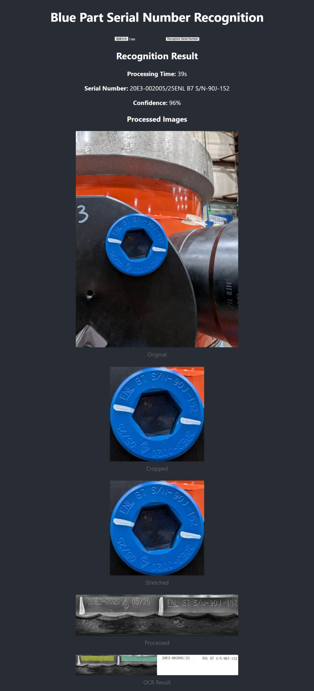

Project Title Image Processing Software for Serial Number Identification

# Project Introduction

This project is a **React** and **Django** based web application with a separated front-end and back-end architecture.  
The front-end is built with React, while the back-end uses Django to provide API support, aiming to create an efficient and scalable web service.

## Tech Stack

- Frontend: React, JavaScript, HTML, CSS  
- Backend: Django, Django REST framework  
- Database: SQLite  
- Image Processing: OpenCV (for image processing)  
- OCR Engine: Local open-source model (requires further evaluation)  
  - PaddleOCR  

## Project Structure

```
├── frontend/      # React frontend project directory
├── backend/       # Django backend project directory
├── docs/          # Project documentation directory
  ├── images.zip  # Test images
└── README.md      # Project documentation file
```

## Quick Start

### 1. Clone the Project

```bash
git clone <project_url>
cd <project_directory>
```

### 2. Install Dependencies
1. Install Python 3.10  
2. Install the latest version of Node.js  
3. Follow the tutorial below to download and install Nginx, then replace the `nginx.conf` file in the Nginx installation directory under the `conf` folder.  
https://nginx.org/  


### 3. Create Python Virtual Environment and Start Backend

Activate the virtual environment:
```bash
py -3.9 -m venv myenv
myenv\Scripts\activate
```

Then, run the following command in Windows PowerShell:
```bash
./start.ps1
```

This will automatically complete the environment update and start both the backend and frontend.

The frontend runs on `http://localhost:3000`, and the backend runs on `http://localhost:8000`.

# Project Screenshot

